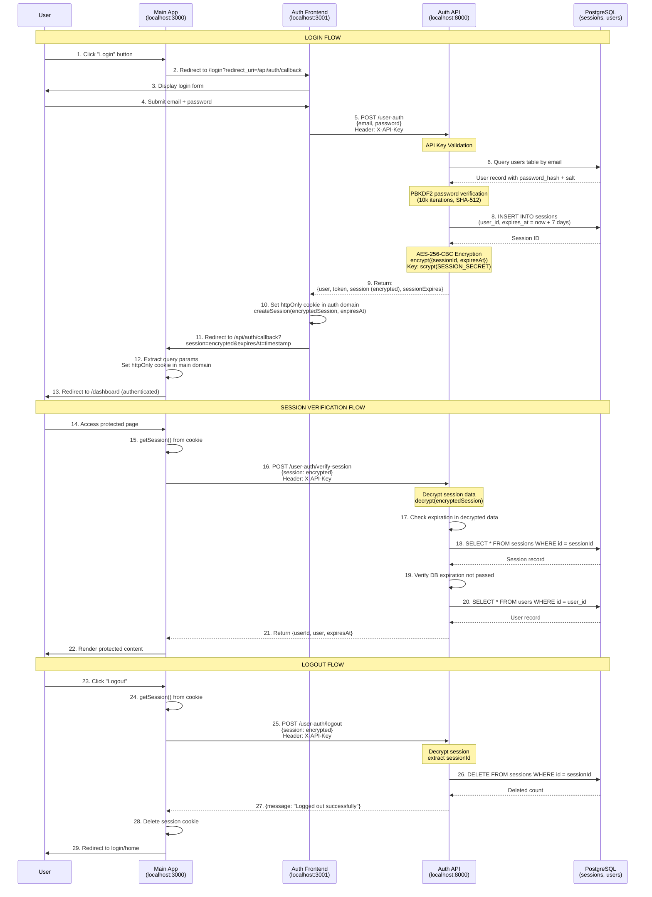
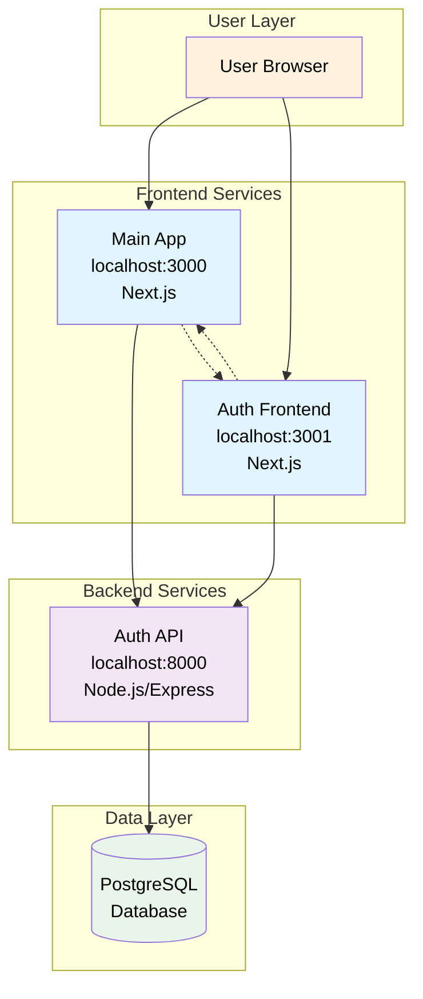
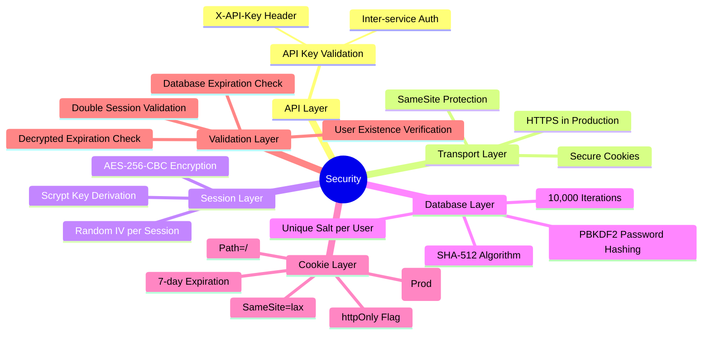

# Authentication & Session Management Flow

## Overview

This document illustrates the complete authentication and session cookie management flow in the ROR RAG Chat application. The system uses a microservices architecture with three main services:

- **Main Frontend** (localhost:3000) - User-facing chat application
- **Auth Frontend** (localhost:3001) - Authentication UI service
- **Auth API** (localhost:8000) - Authentication backend with PostgreSQL

## Security Features

- **API Key Validation**: All auth API endpoints require `X-API-Key` header
- **Password Security**: PBKDF2 hashing with 10,000 iterations, SHA-512 algorithm
- **Session Encryption**: AES-256-CBC encryption with scrypt key derivation
- **Cookie Security**: httpOnly, secure in production, sameSite=lax
- **Session Validation**: Double validation (decrypted expiration + database lookup)

## Complete Authentication Flow



## Key Technical Details

### Session Encryption

```javascript
// Encryption (auth/api/src/utils.js)
export function encrypt(payload) {
  const text = JSON.stringify(payload);
  const key = crypto.scryptSync(SESSION_SECRET, "salt", 32);
  const iv = crypto.randomBytes(16);
  const cipher = crypto.createCipheriv("aes-256-cbc", key, iv);

  let encrypted = cipher.update(text, "utf8", "hex");
  encrypted += cipher.final("hex");

  return `${iv.toString("hex")}:${encrypted}`;
}
```

### Cookie Configuration

```typescript
// Cookie settings (src/lib/session.ts)
cookieStore.set("session", sessionData, {
  httpOnly: true,
  secure: process.env.NODE_ENV === "production",
  expires: expiresAt,
  sameSite: "lax",
  path: "/",
});
```

### Password Verification

```javascript
// PBKDF2 verification (auth/api/src/utils.js)
export function verifyPassword(password, hash, salt) {
  const derivedKey = crypto.pbkdf2Sync(password, salt, 10000, 64, "sha512");
  return derivedKey.toString("hex") === hash;
}
```

## Database Schema

### Sessions Table

```sql
CREATE TABLE sessions (
  id SERIAL PRIMARY KEY,
  user_id INTEGER REFERENCES users(id),
  expires_at TIMESTAMP,
  created_at TIMESTAMP DEFAULT NOW(),
  updated_at TIMESTAMP DEFAULT NOW()
);
```

### Users Table

```sql
CREATE TABLE users (
  id SERIAL PRIMARY KEY,
  email VARCHAR(255) UNIQUE NOT NULL,
  password_hash VARCHAR(255) NOT NULL,
  salt VARCHAR(255) NOT NULL,
  first_name VARCHAR(255),
  last_name VARCHAR(255),
  created_at TIMESTAMP DEFAULT NOW(),
  updated_at TIMESTAMP DEFAULT NOW()
);
```

## API Endpoints

### Authentication API (auth/api/src/routes/user-auth.js)

- `POST /user-auth` - User login
- `POST /user-auth/verify-session` - Session verification
- `POST /user-auth/logout` - User logout
- `POST /user-auth/verify-token` - JWT token verification (unused)

### Main App API (src/app/api/auth/callback/route.ts)

- `GET /api/auth/callback` - Handle auth callback and set session cookie
- `GET /api/auth/check` - Check current authentication status

## Environment Variables

- `API_KEY` - Inter-service authentication
- `JWT_SECRET` - JWT token signing
- `SESSION_SECRET` - Session encryption key
- `AUTH_FRONTEND_URL` - Auth frontend service URL
- `API_URL` - Auth API service URL
- `FRONTEND_URL` - Main frontend URL

## System Architecture



## Security Layers Overview


